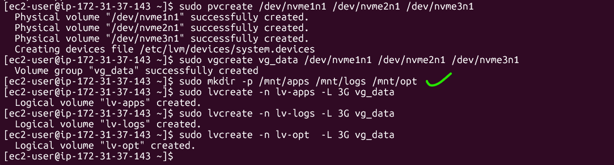
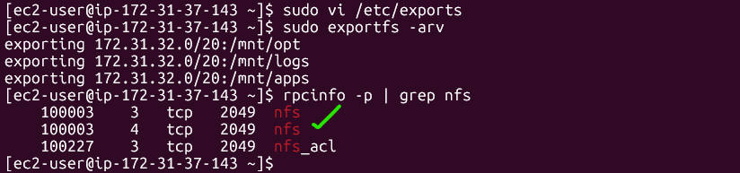

---

# DevOps Tooling Website Solution

This project sets up a **three-tier architecture** with shared storage and database for a tooling website, using AWS EC2 instances, NFS, MySQL, Apache, and PHP.

The solution ensures **stateless web servers** that share files via NFS and store persistent data in MySQL.

---

## Architecture Overview

* **NFS Server**: Provides shared storage (`/mnt/apps`, `/mnt/logs`, `/mnt/opt`) using LVM with XFS.
* **Database Server**: Hosts MySQL database (`tooling`) with restricted user access from webserver subnet.
* **Web Servers (x3)**: Apache + PHP, serving code from NFS mount (`/var/www`) and connecting to the MySQL DB.

---

## Step 1 — Prepare the NFS Server

### 1. Launch an EC2 instance

* AMI: **RHEL 8 (HVM), SSD Volume Type**
* Instance type: t2.micro (or larger if needed)
* Security Group: allow **TCP 22, TCP/UDP 111, UDP 2049**

### 2. Attach additional EBS volumes

Attach **3×10GB EBS volumes** to the instance.

Check with:

```bash
lsblk
```

You should see `/dev/nvme1n1`, `/dev/nvme2n1`, `/dev/nvme3n1`.

### 3. Install LVM utilities

```bash
sudo yum install lvm2 -y
```

### 4. Configure LVM

```bash
# Create physical volumes
sudo pvcreate /dev/nvme1n1 /dev/nvme2n1 /dev/nvme3n1

# Create volume group
sudo vgcreate vg_data /dev/nvme1n1 /dev/nvme2n1 /dev/nvme3n1

# Create logical volumes (adjust sizes as needed)
sudo lvcreate -n lv-apps -L 3G vg_data
sudo lvcreate -n lv-logs -L 3G vg_data
sudo lvcreate -n lv-opt  -L 3G vg_data
```
 
 
### 5. Format with XFS

```bash
sudo mkfs.xfs /dev/vg_data/lv-apps
sudo mkfs.xfs /dev/vg_data/lv-logs
sudo mkfs.xfs /dev/vg_data/lv-opt
```

### 6. Mount logical volumes

```bash
sudo mkdir -p /mnt/apps /mnt/logs /mnt/opt

sudo mount /dev/vg_data/lv-apps /mnt/apps
sudo mount /dev/vg_data/lv-logs /mnt/logs
sudo mount /dev/vg_data/lv-opt  /mnt/opt
```

Make mounts persistent:

```bash
sudo blkid
```

Add UUID entries to `/etc/fstab`:

```
UUID=<uuid-apps> /mnt/apps xfs defaults 0 0
UUID=<uuid-logs> /mnt/logs xfs defaults 0 0
UUID=<uuid-opt>  /mnt/opt  xfs defaults 0 0
```

### 7. Install & configure NFS

```bash
sudo yum -y update
sudo yum install nfs-utils -y
sudo systemctl start nfs-server.service
sudo systemctl enable nfs-server.service
sudo systemctl status nfs-server.service
```

Set permissions:

```bash
sudo chown -R nobody: /mnt/apps
sudo chown -R nobody: /mnt/logs
sudo chown -R nobody: /mnt/opt

sudo chmod -R 777 /mnt/apps
sudo chmod -R 777 /mnt/logs
sudo chmod -R 777 /mnt/opt

sudo systemctl restart nfs-server.service
```

Export shares (replace `<Subnet-CIDR>` with your webserver subnet, e.g., `172.31.32.0/20`):

```bash
sudo vi /etc/exports

/mnt/apps <Subnet-CIDR>(rw,sync,no_all_squash,no_root_squash)
/mnt/logs <Subnet-CIDR>(rw,sync,no_all_squash,no_root_squash)
/mnt/opt <Subnet-CIDR>(rw,sync,no_all_squash,no_root_squash)

Esc + :wq!

sudo exportfs -arv
```
 
---

## Step 2 — Configure the Database Server

### 1. Launch an EC2 instance

* AMI: **RHEL 8**
* Security Group: allow **TCP 3306** from Web Server subnet only.

### 2. Install MySQL

```bash
sudo yum install @mysql -y
sudo systemctl start mysqld
sudo systemctl enable mysqld
```

### 3. Secure MySQL

```bash
sudo mysql_secure_installation
```

### 4. Create tooling DB and user

```sql
CREATE DATABASE tooling;

CREATE USER 'webaccess'@'<Web-Subnet-CIDR>' IDENTIFIED BY 'yourpassword';

GRANT ALL PRIVILEGES ON tooling.* TO 'webaccess'@'<Web-Subnet-CIDR>';

FLUSH PRIVILEGES;
```

---

## Step 3 — Prepare the Web Servers

Repeat on all **3 Web Servers**.

### 1. Launch EC2 instances

* AMI: **RHEL 8**
* Security Group: allow **TCP 22, TCP 80**

### 2. Install NFS client

```bash
sudo yum install nfs-utils nfs4-acl-tools -y
```

### 3. Mount shared folders

```bash
sudo mkdir -p /var/www
sudo mount -t nfs <NFS-Private-IP>:/mnt/apps /var/www
```

Make persistent:

```bash
echo "<NFS-Private-IP>:/mnt/apps /var/www nfs defaults 0 0" | sudo tee -a /etc/fstab
```

For Apache logs:

```bash
sudo mkdir -p /var/log/httpd
sudo mount -t nfs <NFS-Private-IP>:/mnt/logs /var/log/httpd
echo "<NFS-Private-IP>:/mnt/logs /var/log/httpd nfs defaults 0 0" | sudo tee -a /etc/fstab
```

### 4. Install Apache & PHP

```bash
sudo yum install httpd -y
sudo dnf install https://dl.fedoraproject.org/pub/epel/epel-release-latest-8.noarch.rpm -y
sudo dnf install dnf-utils http://rpms.remirepo.net/enterprise/remi-release-8.rpm -y
sudo dnf module reset php -y
sudo dnf module enable php:remi-7.4 -y
sudo dnf install php php-opcache php-gd php-curl php-mysqlnd -y

sudo systemctl start httpd php-fpm
sudo systemctl enable httpd php-fpm
```

Disable SELinux (optional if causing 403):

```bash
sudo setenforce 0
sudo sed -i 's/^SELINUX=.*/SELINUX=disabled/' /etc/sysconfig/selinux
```

### 5. Deploy tooling app

Fork [StegHub tooling repo](https://github.com/StegHub/tooling) → clone into `/var/www/html`:

```bash
cd /var/www
sudo git clone https://github.com/<your-username>/tooling.git
sudo cp -r tooling/html/* /var/www/html/
```

### 6. Configure DB connection

Edit `/var/www/html/functions.php` and set:

```php
$db = mysqli_connect('<DB-Private-IP>', 'webaccess', 'yourpassword', 'tooling');
```

### 7. Load DB schema

```bash
mysql -h <DB-Private-IP> -u webaccess -p tooling < /var/www/html/tooling-db.sql
```

### 8. Create admin user

```sql
INSERT INTO users (id, username, password, email, user_type, status)
VALUES (1, 'myuser', '5f4dcc3b5aa765d61d8327deb882cf99', 'user@mail.com', 'admin', '1');
```

(Password here = `password`, MD5 hashed)

---

## Step 4 — Test the Setup

1. Open your browser:

   ```
   http://<Web-Server-Public-IP>/index.php
   ```
2. Login with:

   * **Username:** `myuser`
   * **Password:** `password`

If login works and you can create data across all 3 web servers, NFS + DB integration is successful 🎉.

---

✅ Done! You now have a fully working **DevOps Tooling Website** with shared NFS storage, a centralized database, and stateless web servers.

---
